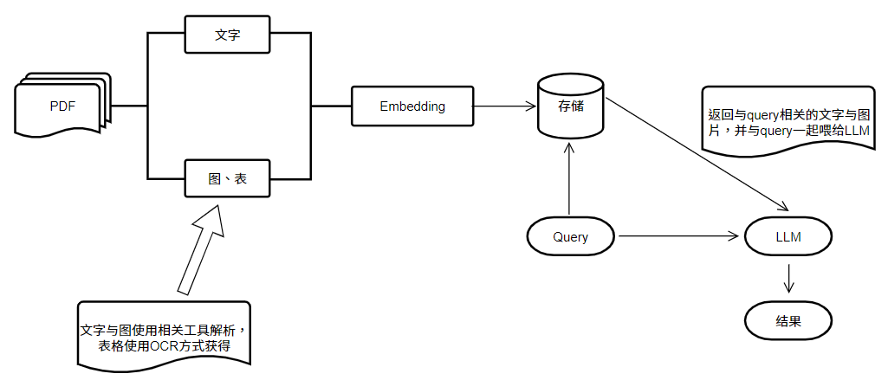
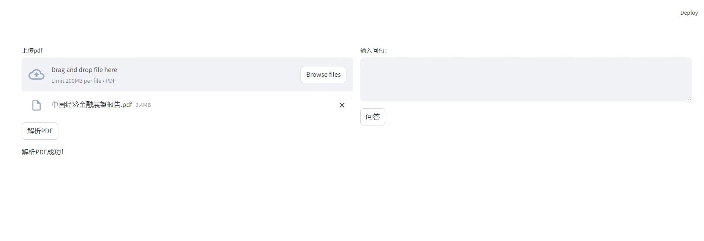
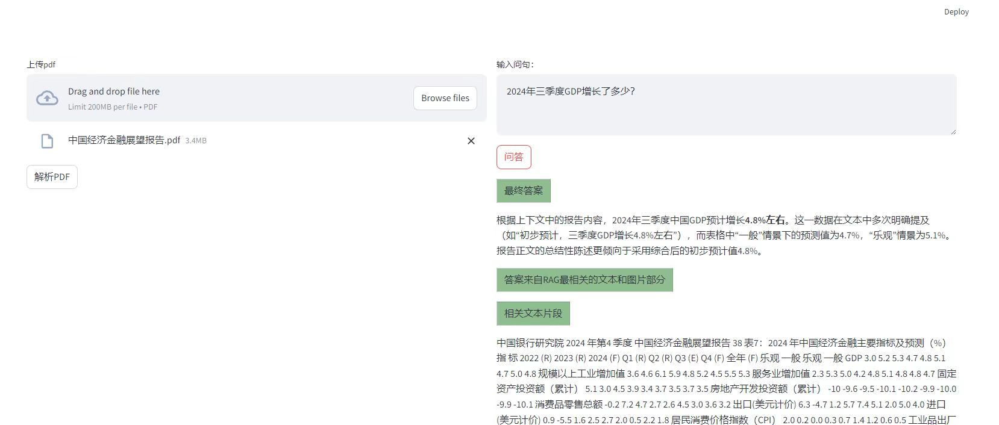
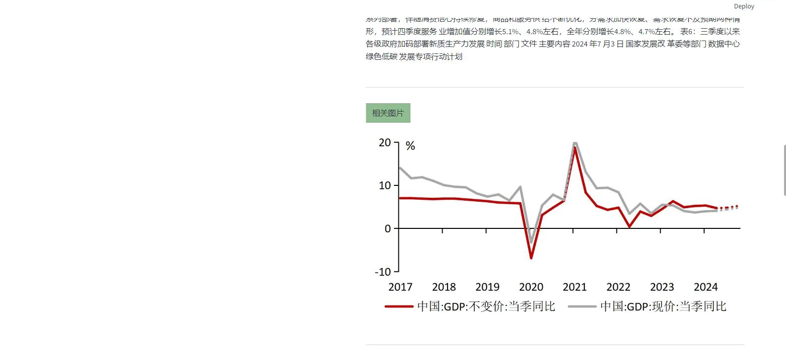

### pdf multimodal rag 【pdf多模态rag问答】

  

-----------------------------------------------------------------------
本项目对PDF文件进行解析，对其中的图、表以及文本进行Embedding化，并进行存储。根据用户query进行检索，将检索后的结果(包括图表和文本)和query输送到多模态LLM,

从而得到最终分析结果。
 
pdf_multimodal_rag 项目主要包含pdf解析，表格检测，文本和图表的embedding化，向量存储，向量检索，LLM问答等部分。

In this project, the PDF file is parsed, the graphs, tables and texts in it are embedded and stored. 

The retrieval is carried out according to the user query, and the retrieved results (including charts and text) 

and the query are fed to the multi-modal LLM to obtain the final analysis results.

The pdf_multimodal_rag project mainly contains pdf parsing, table detection, embedding of text and charts, 

vector storage, vector retrieval, LLM question answering and other parts.

pdf_multimodal_rag 有以下功能：

* pdf文字及图解析(pdf parse) --> src/parse or parse_and_store_embedding.py

* pdf表格检测(pdf table detection) --> src/parse or parse_and_store_embedding.py

* text/image/table embedding --> src/parse or parse_and_store_embedding.py

* embedding存储(embedding store) --> src/store or parse_and_store_embedding.py

* embedding检索(embedding retriever) --> src/retriever or retriever_embedding_from_local.py

* LLM问答(LLM QA) --> rag_chat_from_llm.py
--------------------------------------------------------------------------------

### 说明

* pdf文及图的解析利用fitz，表格的检测利用目标检测模型，下载表格检测模型https://huggingface.co/jiangnanboy/table_det

* 文本的embedding利用nomic-ai/nomic-embed-text-v1.5，图片的embedding利用nomic-ai/nomic-embed-vision-v1.5
可以自行去下载相关模型https://huggingface.co/nomic-ai

* 当前embedding模型使用的是google/siglip-large-patch16-384 

* llm问答部分使用的是ollama部署的多模态模型qwen2.5vl:72b，自行部署或者使用其他多模态模型都可以

### 安装

1. 新建pythn 3.11虚拟环境
2. 执行 `pip install -r requirements.txt`

### 运行

1. 启动虚拟环境 `source ../ragflow/.venv/bin/activate`
2. 运行 `streamlit run ui_web.py`

### ui

【ui_web.py】

利用streamlit实现web页面:

* 上传pdf文件，并解析

* 输入查询query

* 返回最终答案

* 返回原始pdf中的相关文本及图表

  

  

  

### contact
1、github：https://github.com/jiangnanboy

2、blog：https://www.cnblogs.com/little-horse/

3、e-mail:2229029156@qq.com

